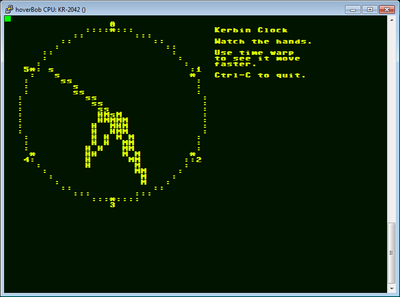

## lib_term

``lib_term.ks`` provides useful routines to let you paint character-cell
drawing primitives on the terminal for old-school character user displays.

The intent is to allow you to combine these elements to make things
such as dial indicators, slider indicators, plot graphs, and so on.

As of this writing it only has a line draw and an ellipse draw function,
but more can be added.

None of the implementations use the classic integer optimizations
such as the Bresenham's algorithms, because such optimizations
don't help in kOS where everything is being abstracted so
much that you're not *really* getting integer opcodes anyway.
Just using whichever method causes the least kRISC opcodes is
the faster way to go in the world of kOS.

Here is an example clock display from the examples folder, using
the char_circle and char_line primitives to draw the clock face
and the hands:

### char_line

args:
  * ch: a string that should contain 1 char - the character to "paint" with.
  * x0: scalar - start of line, character column
  * y0: scalar - start of line, character row
  * x1: scalar - end of line, character column
  * y1: scalar - end of line, character row

returns:
  * nothing.

description:
  * Uses PRINT AT to draw a line of characters on the terminal
    window using the character you give it, starting at PRINT AT
    position (x0,y0) and ending at PRINT AT position (x1,y1).

### char_circle

args:
  * ch: a string that should contain 1 char - the character to "paint" with.
  * x0: scalar - center point of circle, character column
  * y0: scalar - center point of circle, character row
  * r: scalar - radius of circle.

returns:
  * nothing.

description:
  * Using the character given to paint with, it paints a circle on
    the terminal screen in character cells.  Note that this makes a
    "logical" circle, NOT a "visual" one.  Meaning, that it will
    be an equal number of characters wide as it is tall.  Given that
    most terminal fonts are much taller than they are wide, this
    will likely appear out of proportion on a telnet window, looking
    too tall.  The in-game terminal font is fairly wide, however, and
    it looks pretty good using such a font.  If you use telnet, you
    can get similar behavior by picking a rather wide telnet font.

### char_ellipse_arc

args:
  * ch: a string that should contain 1 char - the character to "paint" with.
  * x0: scalar - center point of ellipse, character column
  * y0: scalar - center point of ellipse, character row
  * xRad: scalar - Radius of ellipse in the horizontal direction.
  * yRad: scalar - Radius of ellipse in the vertical direction.
  * deg0: scalar - degree position to start drawing arc at.
  * deg1: scalar - degree position to stop drawing arc at.

returns:
  * nothing.

description:
  * Using the character given to paint with, it paints an arc of an
    ellipse on the terminal using the character cells, with the given
    parameters.  The ellipse can only be aligned with the x/y axes.
    (The ellipse's semi-major and semi-minor axes must be horizontal
    and vertical, or visa versa).  Using the same value for xRad and
    yRad gives a circle, of course.
    GOTCHAS: Be aware that on the terminal screen, positive Y is DOWN,
    not UP, which may yield confusing results about which way is
    positive degrees of the arc, if you're not taking it into account.

---
Copyright © 2015,2020 KSLib team

This work and any code samples presented herein are licensed under the [MIT license](../LICENSE).

Original starting work by Github user: Dunbaratu